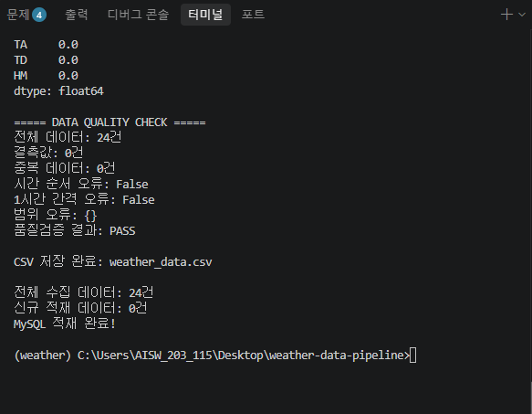
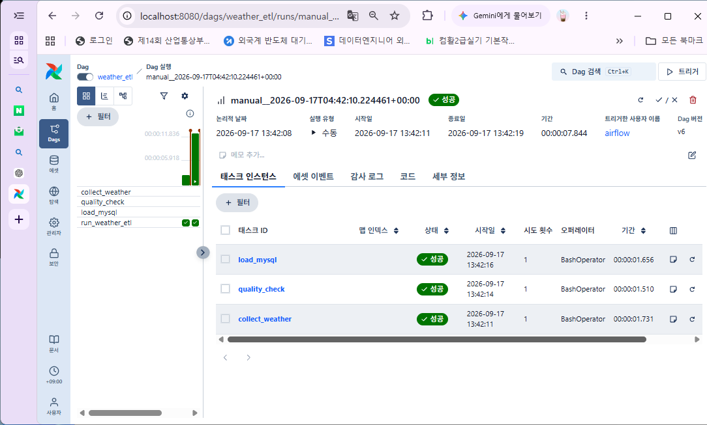
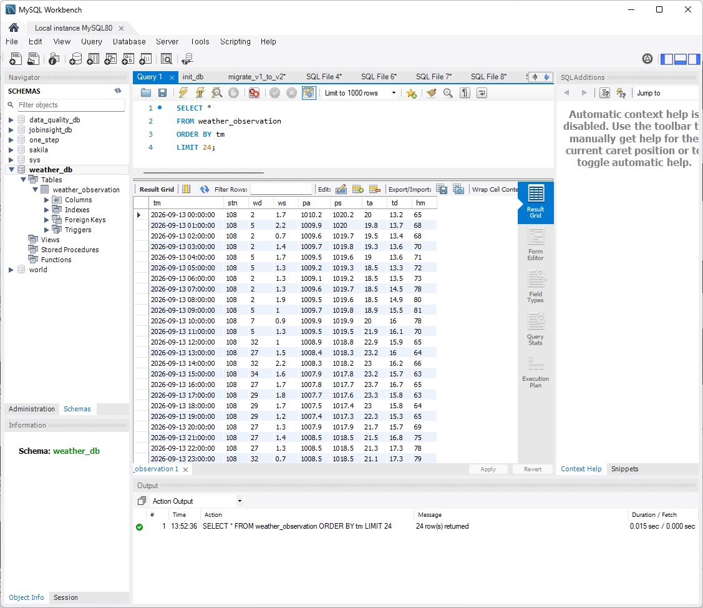

# KMA Weather Data Pipeline

기상청 ASOS API를 활용한 기상 데이터 수집·품질검증·MySQL 적재 및 ETL 자동화 프로젝트

> 현재 개발 진행 중인 프로젝트입니다.

---

## 📌 프로젝트 소개

기상청 API Hub에서 서울 지역의 시간별 기상 데이터를 수집하고,
Python을 이용해 데이터를 전처리 및 검증한 후 MySQL에 적재하는
데이터 파이프라인을 구축하고 있습니다.

현재 Python 기반 ETL, Data Quality Check, MySQL 적재,
Airflow를 활용한 ETL 자동화, Docker 기반 Airflow 환경 구성,
FastAPI 기반 데이터 조회 API까지 구현했습니다.

이후 Dashboard를 추가하여 데이터 수집부터 저장, API 제공 및
시각화까지 연결되는 데이터 엔지니어링 프로젝트로 확장할 예정입니다.

---

## 🎯 프로젝트 목표

- 외부 API를 활용한 데이터 수집
- Python 기반 ETL 구현
- 데이터 품질검증(Data Quality) 구현
- MySQL 데이터베이스 적재
- Airflow를 활용한 ETL 자동화
- Docker Compose 기반 Airflow 실행 환경 구성
- FastAPI를 활용한 데이터 조회 API 구현
- Dashboard를 통한 데이터 시각화
- 전체 서비스의 실행 환경 및 운영 구조 개선

---

## 🏗️ 데이터 파이프라인 구조

```text
기상청 KMA ASOS API
        ↓
Python 데이터 수집
        ↓
데이터 전처리
        ↓
Data Quality Check
 ├─ 결측값 검사
 ├─ 중복 데이터 검사
 ├─ 시간 순서 검사
 ├─ 1시간 간격 검사
 └─ 값의 허용 범위 검사
        ↓
CSV 저장
        ↓
MySQL 적재
        ↓
FastAPI
        ↓
데이터 조회 API
        ↓
Dashboard (예정)
```

### 자동화 환경

```text
Docker
   ↓
Docker Compose
   ↓
Apache Airflow
   ↓
ETL DAG
   ├─ collect_weather
   ├─ quality_check
   └─ load_mysql
```

---

## 🔧 기술 스택

| 분야 | 기술 |
|---|---|
| Language | Python |
| Data Processing | Pandas |
| API | KMA API Hub |
| Database | MySQL |
| DB Connection | SQLAlchemy, PyMySQL |
| Environment | Anaconda |
| Workflow | Apache Airflow |
| Container | Docker, Docker Compose |
| Backend API | FastAPI |
| Dashboard | 예정 |

---

## 📊 데이터

### 데이터 출처

기상청 API Hub의 ASOS 시간별 관측 데이터를 활용합니다.

- 관측 지점: 서울(108)
- 데이터 주기: 1시간
- 현재 수집 단위: 하루 단위

### 주요 컬럼

| 컬럼 | 설명 |
|---|---|
| TM | 관측 시각 |
| STN | 관측소 번호 |
| WD | 풍향 |
| WS | 풍속 |
| PA | 현지기압 |
| PS | 해면기압 |
| TA | 기온 |
| TD | 이슬점온도 |
| HM | 상대습도 |

---

## 🔍 Data Quality Check

수집된 데이터를 MySQL에 적재하기 전에 기본적인 데이터 품질검증을 수행합니다.

### 1. 결측값 검사

데이터 내 결측값의 개수를 확인합니다.

```text
결측값: 0건
```

### 2. 중복 데이터 검사

`TM + STN`을 기준으로 중복 데이터를 검사합니다.

```text
중복 데이터: 0건
```

### 3. 시간 순서 검사

관측 시간이 올바른 순서로 정렬되어 있는지 확인합니다.

```text
시간 순서 오류: False
```

### 4. 시간 간격 검사

시간별 데이터가 1시간 간격으로 연속되는지 검사합니다.

```text
1시간 간격 오류: False
```

### 5. 값의 허용 범위 검사

주요 기상 데이터의 비정상적인 값을 확인합니다.

```text
WD : 0 ~ 360
WS : 0 이상
HM : 0 ~ 100
TA : -50 ~ 60℃
```

### 현재 검증 결과

```text
===== DATA QUALITY CHECK =====
전체 데이터: 24건
결측값: 0건
중복 데이터: 0건
시간 순서 오류: False
1시간 간격 오류: False
범위 오류: {}
품질검증 결과: PASS
```

---

## 🗄️ MySQL 적재

MySQL의 `weather_observation` 테이블에 데이터를 적재합니다.

동일한 `TM + STN` 데이터가 다시 들어오는 경우
중복 적재를 방지하도록 구성했습니다.

```text
KMA API
   ↓
Python ETL
   ↓
Data Quality Check
   ↓
MySQL
```

---

## ⚙️ Airflow ETL 자동화

Apache Airflow를 Docker Compose 환경에서 구성하여
ETL 파이프라인을 자동화했습니다.

### DAG 구조

```text
collect_weather
       ↓
quality_check
       ↓
load_mysql
```

Airflow를 통해 기상 데이터를 수집하고,
품질검증 후 MySQL에 적재하는 과정을 자동화하도록 구성했습니다.

---

## 🐳 Docker

Docker Compose를 활용하여 Airflow 실행 환경을 구성했습니다.

Docker 환경에서 Airflow의 주요 구성 요소를 실행하고,
Weather 프로젝트의 코드를 Airflow 환경과 연결하여
ETL DAG를 실행할 수 있도록 구성했습니다.

현재는 Airflow 실행 환경을 Docker로 구성한 상태이며,
향후 MySQL, FastAPI 등을 포함한 전체 서비스의
Docker Compose 통합 환경으로 확장할 예정입니다.

---

## 🌐 FastAPI

MySQL에 적재된 기상 데이터를 REST API 형태로 조회할 수 있도록
FastAPI를 구현했습니다.

### 구현 기능

- FastAPI 서버 실행
- MySQL 연결
- `weather_observation` 테이블 조회
- 최근 기상 데이터 24건 JSON 반환

### API

```text
GET /api/weather
```

실행 예시:

```text
http://127.0.0.1:8001/api/weather
```

FastAPI를 통해 MySQL에 저장된 실제 기상 데이터를
JSON 형태로 제공하도록 구성했습니다.

---

## 🖥️ 실행 화면

### 1. Python ETL 및 Data Quality Check



### 2. Airflow ETL 실행



### 3. MySQL 데이터 적재 결과



### 4. FastAPI 데이터 조회


> `images/` 폴더에 실제 이미지 파일을 업로드하면 GitHub README에서 화면이 표시됩니다.

---

## 📈 개발 진행 상황

- [x] KMA API 연동
- [x] 기상 데이터 수집
- [x] 데이터 전처리
- [x] 결측값 검사
- [x] 중복 데이터 검사
- [x] 시간 순서 검사
- [x] 1시간 간격 검사
- [x] 값 범위 검사
- [x] MySQL 적재
- [x] Airflow 환경 구성
- [x] Docker Compose 기반 Airflow 환경 구성
- [x] Airflow ETL DAG 구성
- [x] FastAPI 데이터 조회 API
- [ ] Dashboard 구축
- [ ] MySQL + FastAPI + Airflow 전체 Docker Compose 통합
- [ ] 프로젝트 문서화 및 운영 구조 개선

---

## 💡 프로젝트를 통해 학습한 내용

- 외부 API 데이터 수집 및 처리
- ETL 파이프라인 구성
- 데이터 품질검증의 필요성
- 관계형 데이터베이스 적재
- 중복 데이터 처리
- 시계열 데이터의 연속성 검증
- Airflow DAG 구성
- Docker Compose 기반 실행 환경 구성
- FastAPI를 활용한 데이터 제공
- 데이터 파이프라인과 API의 연결

---

## 📁 프로젝트 구조

```text
kma-weather-data-pipeline/
├── api/
│   └── main.py
│
├── dags/
│   └── weather_etl_dag.py
│
├── images/
│   ├── etl-result.png
│   ├── airflow-dag.png
│   ├── mysql-data.png
│   └── fastapi-weather.png
│
├── 01_api_test.py
├── 02_collect_weather.py
├── README.md
├── .gitignore
└── .env
```

> `.env`에는 API Key 및 데이터베이스 접속 정보가 포함되어 있으므로 GitHub에 업로드하지 않습니다.

---

## 🔐 환경변수

프로젝트 실행을 위해 `.env` 파일에 API 및 MySQL 접속 정보를 설정합니다.

```text
KMA_AUTH_KEY=YOUR_API_KEY

MYSQL_HOST=localhost
MYSQL_PORT=3306
MYSQL_USER=root
MYSQL_PASSWORD=YOUR_PASSWORD
MYSQL_DATABASE=weather_db
```

> 실제 API Key와 비밀번호는 GitHub에 공개하지 않습니다.
